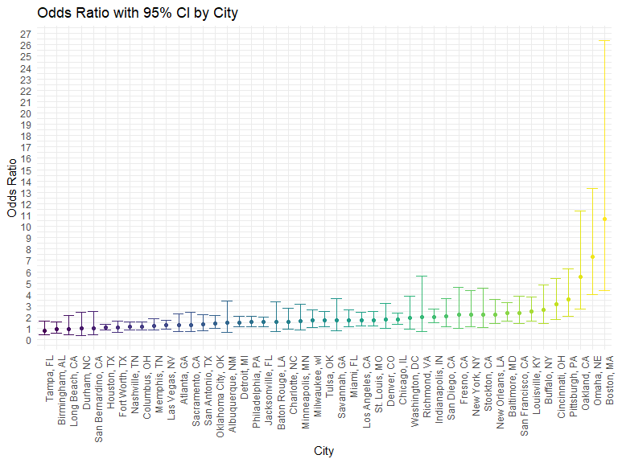
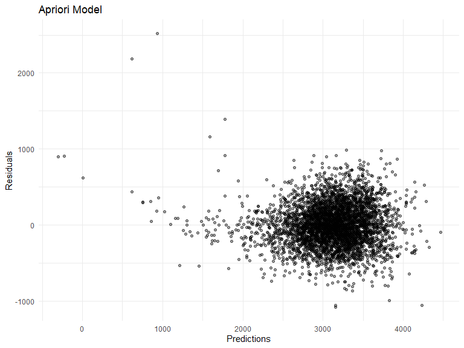
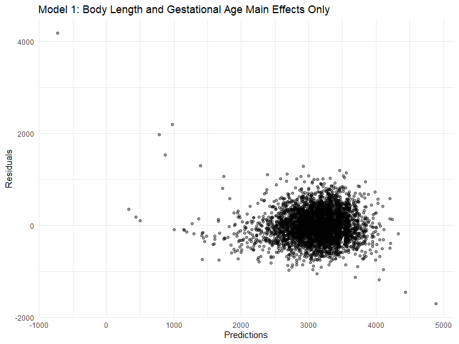
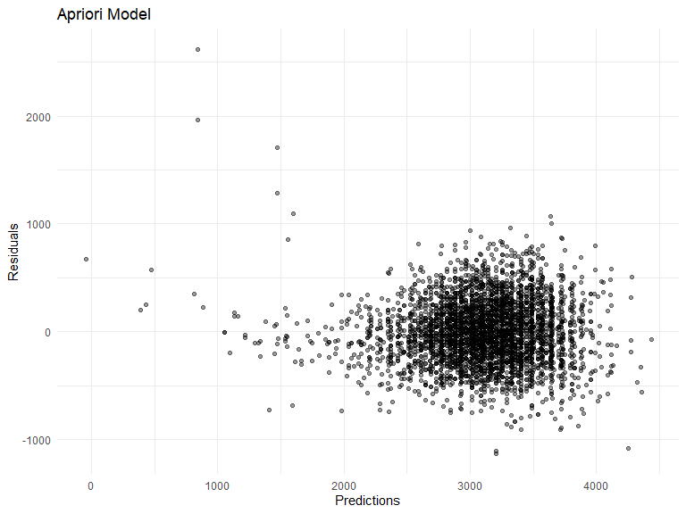

Homework 6 solutions
================
Jeff Goldsmith
2020-12-09

### Problem 1

Read in and tidy the data.

``` r
homicide_df = 
  read_csv("./data/homicide-data.csv", na = c("", "NA", "Unknown")) %>% 
  mutate(
    city_state = str_c(city, state, sep = ", "),
    victim_age = as.numeric(victim_age),
    resolution = case_when(
      disposition == "Closed without arrest" ~ 0,
      disposition == "Open/No arrest"        ~ 0,
      disposition == "Closed by arrest"      ~ 1)
  ) %>% 
  filter(
    victim_race %in% c("White", "Black"),
    city_state != "Tulsa, AL") %>% 
  select(city_state, resolution, victim_age, victim_race, victim_sex)
```

Fitting Logistic Regression for one city, trying to predict resolution
of case using victim age, race, and sex.

``` r
baltimore_df =
  homicide_df %>% 
  filter(city_state == "Baltimore, MD")
glm(resolution ~ victim_age + victim_race + victim_sex, 
    data = baltimore_df,
    family = binomial()) %>% 
  broom::tidy() %>% 
  mutate(
    OR = exp(estimate),
    CI_lower = exp(estimate - 1.96 * std.error),
    CI_upper = exp(estimate + 1.96 * std.error)
  ) %>% 
  select(term, OR, starts_with("CI")) %>% 
  knitr::kable(digits = 3)
```

| term              |    OR | CI\_lower | CI\_upper |
| :---------------- | ----: | --------: | --------: |
| (Intercept)       | 1.363 |     0.975 |     1.907 |
| victim\_age       | 0.993 |     0.987 |     1.000 |
| victim\_raceWhite | 2.320 |     1.648 |     3.268 |
| victim\_sexMale   | 0.426 |     0.325 |     0.558 |

Running this same logistic model across cities.

``` r
models_results_df = 
  homicide_df %>% 
  nest(data = -city_state) %>% 
  mutate(
    models = 
      map(.x = data, ~glm(resolution ~ victim_age + victim_race + victim_sex, data = .x, family = binomial())),
    results = map(models, broom::tidy)
  ) %>% 
  select(city_state, results) %>% 
  unnest(results) %>% 
  mutate(
    OR = exp(estimate),
    CI_lower = exp(estimate - 1.96 * std.error),
    CI_upper = exp(estimate + 1.96 * std.error)
  ) %>% 
  select(city_state, term, OR, starts_with("CI")) 
```

Plotting ORs with 95 CI for each of the cities.

``` r
models_results_df %>% 
  filter(term == "victim_raceWhite") %>% 
  mutate(city_state = fct_reorder(city_state, OR)) %>% 
  ggplot(aes(x = city_state, y = OR, color = city_state)) + 
  geom_point() + 
  geom_errorbar(aes(ymin = CI_lower, ymax = CI_upper)) + 
  theme(axis.text.x = element_text(angle = 90, hjust = 1), legend.position = "none") +
  labs(
    title = "Odds Ratio with 95% CI by City",
    x = "City",
    y = "Odds Ratio") +
  scale_y_continuous(breaks = seq(0, 28, by = 1))
```



It seems like all the ORs are above 1 for every city, meaning the odds
of solving a homicide for a white victim are better than the odds of
solving a homicide for a black victim. Oakland, Omaha, Boston, and
Pittsburgh are the cities with the highest ORs.

## Problem 2

Read in and tidy data set as well as change variables to factors as
appropriate. We also checked that all 4342 entries for every variable
returns false when checking for missing values.

``` r
baby_df =
  read_csv("./data/birthweight.csv") %>% 
  janitor::clean_names() %>% 
  mutate(babysex = as.factor(babysex),
         frace = as.factor(frace),
         malform = as.factor(malform),
         mrace = as.factor(mrace))
 
baby_df %>% is.na() %>% summary()
```

``` 
  babysex          bhead          blength           bwt         
 Mode :logical   Mode :logical   Mode :logical   Mode :logical  
 FALSE:4342      FALSE:4342      FALSE:4342      FALSE:4342     
   delwt          fincome          frace          gaweeks       
 Mode :logical   Mode :logical   Mode :logical   Mode :logical  
 FALSE:4342      FALSE:4342      FALSE:4342      FALSE:4342     
  malform         menarche        mheight          momage       
 Mode :logical   Mode :logical   Mode :logical   Mode :logical  
 FALSE:4342      FALSE:4342      FALSE:4342      FALSE:4342     
   mrace           parity         pnumlbw         pnumsga       
 Mode :logical   Mode :logical   Mode :logical   Mode :logical  
 FALSE:4342      FALSE:4342      FALSE:4342      FALSE:4342     
   ppbmi            ppwt           smoken          wtgain       
 Mode :logical   Mode :logical   Mode :logical   Mode :logical  
 FALSE:4342      FALSE:4342      FALSE:4342      FALSE:4342     
```

``` r
baby_df
```

    # A tibble: 4,342 x 20
       babysex bhead blength   bwt delwt fincome frace gaweeks malform menarche
       <fct>   <dbl>   <dbl> <dbl> <dbl>   <dbl> <fct>   <dbl> <fct>      <dbl>
     1 2          34      51  3629   177      35 1        39.9 0             13
     2 1          34      48  3062   156      65 2        25.9 0             14
     3 2          36      50  3345   148      85 1        39.9 0             12
     4 1          34      52  3062   157      55 1        40   0             14
     5 2          34      52  3374   156       5 1        41.6 0             13
     6 1          33      52  3374   129      55 1        40.7 0             12
     7 2          33      46  2523   126      96 2        40.3 0             14
     8 2          33      49  2778   140       5 1        37.4 0             12
     9 1          36      52  3515   146      85 1        40.3 0             11
    10 1          33      50  3459   169      75 2        40.7 0             12
    # ... with 4,332 more rows, and 10 more variables: mheight <dbl>, momage <dbl>,
    #   mrace <fct>, parity <dbl>, pnumlbw <dbl>, pnumsga <dbl>, ppbmi <dbl>,
    #   ppwt <dbl>, smoken <dbl>, wtgain <dbl>

I have hypothesised a model based on apriori hypotheses which focus on
physical and growth attributes for the baby (body length, head
circumference, gestational age) and weight attributes of the mother
(pre-pregnancy weight, weight at delivery, weight gained during
pregnancy) to predict birthweight for the baby. I also thought to
include a delwt\*wtgain interaction term since weight gained during
pregnancy is related to mother’s weight at delivery (buit not
pre-preganncy weight).

``` r
my_model = lm(bwt ~ blength + bhead + gaweeks + delwt + ppwt + wtgain + delwt*wtgain, data = baby_df)

baby_df %>% 
  add_residuals(my_model) %>% 
  add_predictions(my_model) %>%
  ggplot(aes(x = pred, y = resid)) + 
  geom_point(alpha = .4) +
  labs(
    title = "Apriori Model",
    x = "Predictions",
    y = "Residuals")
```



Prediction values seem to be concentrated between 2500 and 4000 while
the residual values seem to aggregate between -600 and 1000.

``` r
model_1 = lm(bwt ~ blength + gaweeks, data = baby_df)

baby_df %>% 
  add_residuals(model_1) %>% 
  add_predictions(model_1) %>%
  ggplot(aes(x = pred, y = resid)) + 
  geom_point(alpha = .4) +
  labs(
    title = "Model 1: Baby Body Length and Gestational Age Main Effects Only",
    x = "Predictions",
    y = "Residuals")
```



``` r
model_2 = lm(bwt ~ (blength + bhead + babysex)^2 + blength*bhead*babysex, data = baby_df)

baby_df %>% 
  add_residuals(model_2) %>% 
  add_predictions(model_2) %>%
  ggplot(aes(x = pred, y = resid)) + 
  geom_point(alpha = .4) +
  labs(
    title = "Apriori Model",
    x = "Predictions",
    y = "Residuals")
```


