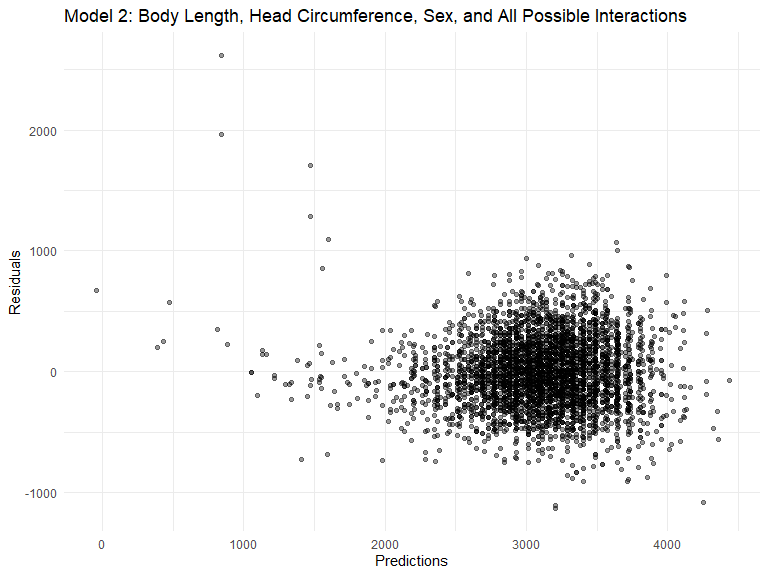
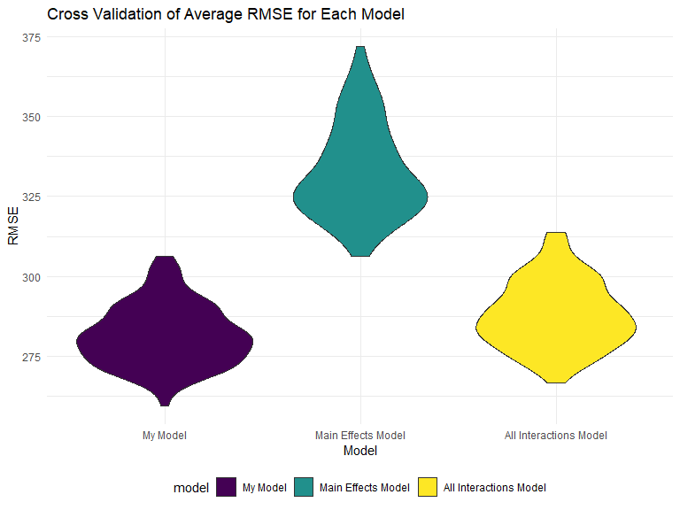
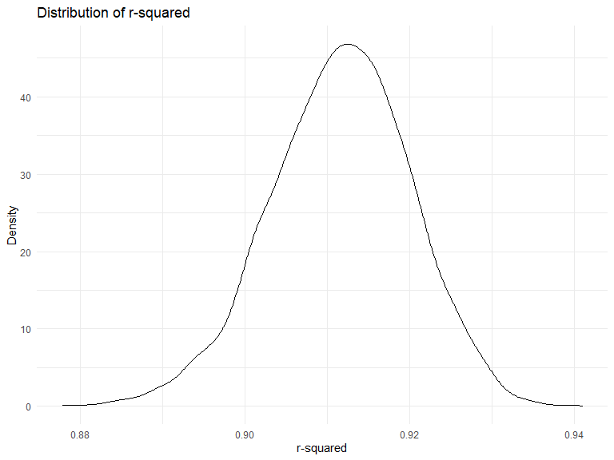
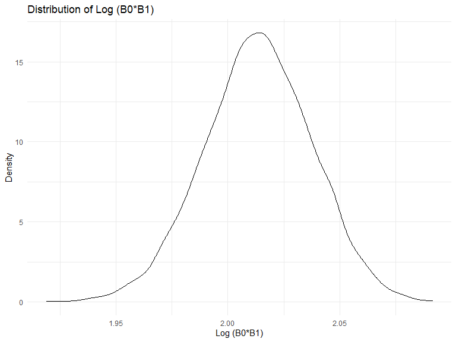

Homework 6
================
Salah El-Sadek

## Problem 1

Read in and tidy the data.

``` r
homicide_df = 
  read_csv("./data/homicide-data.csv", na = c("", "NA", "Unknown")) %>% 
  mutate(
    city_state = str_c(city, state, sep = ", "),
    victim_age = as.numeric(victim_age),
    resolution = case_when(
      disposition == "Closed without arrest" ~ 0,
      disposition == "Open/No arrest"        ~ 0,
      disposition == "Closed by arrest"      ~ 1)
  ) %>% 
  filter(
    victim_race %in% c("White", "Black"),
    city_state != "Tulsa, AL") %>% 
  select(city_state, resolution, victim_age, victim_race, victim_sex)
```

Fitting Logistic Regression for one city, trying to predict resolution
of case using victim age, race, and sex.

``` r
baltimore_df =
  homicide_df %>% 
  filter(city_state == "Baltimore, MD")
glm(resolution ~ victim_age + victim_race + victim_sex, 
    data = baltimore_df,
    family = binomial()) %>% 
  broom::tidy() %>% 
  mutate(
    OR = exp(estimate),
    CI_lower = exp(estimate - 1.96 * std.error),
    CI_upper = exp(estimate + 1.96 * std.error)
  ) %>% 
  select(term, OR, starts_with("CI")) %>% 
  knitr::kable(digits = 3)
```

| term              |    OR | CI\_lower | CI\_upper |
| :---------------- | ----: | --------: | --------: |
| (Intercept)       | 1.363 |     0.975 |     1.907 |
| victim\_age       | 0.993 |     0.987 |     1.000 |
| victim\_raceWhite | 2.320 |     1.648 |     3.268 |
| victim\_sexMale   | 0.426 |     0.325 |     0.558 |

Running this same logistic model across cities.

``` r
models_results_df = 
  homicide_df %>% 
  nest(data = -city_state) %>% 
  mutate(
    models = 
      map(.x = data, ~glm(resolution ~ victim_age + victim_race + victim_sex, data = .x, family = binomial())),
    results = map(models, broom::tidy)
  ) %>% 
  select(city_state, results) %>% 
  unnest(results) %>% 
  mutate(
    OR = exp(estimate),
    CI_lower = exp(estimate - 1.96 * std.error),
    CI_upper = exp(estimate + 1.96 * std.error)
  ) %>% 
  select(city_state, term, OR, starts_with("CI")) 
```

Plotting ORs with 95 CI for each of the cities.

``` r
models_results_df %>% 
  filter(term == "victim_raceWhite") %>% 
  mutate(city_state = fct_reorder(city_state, OR)) %>% 
  ggplot(aes(x = city_state, y = OR, color = city_state)) + 
  geom_point() + 
  geom_errorbar(aes(ymin = CI_lower, ymax = CI_upper)) + 
  theme(axis.text.x = element_text(angle = 90, hjust = 1), legend.position = "none") +
  labs(
    title = "Odds Ratio with 95% CI by City",
    x = "City",
    y = "Odds Ratio") +
  scale_y_continuous(breaks = seq(0, 28, by = 1))
```


It seems like all the ORs are above 1 for every city, meaning the odds
of solving a homicide for a white victim are better than the odds of
solving a homicide for a black victim. Oakland, Omaha, Boston, and
Pittsburgh are the cities with the highest ORs.

## Problem 2

Read in and tidy data set as well as change variables to factors as
appropriate. We also checked that all 4342 entries for every variable
returns false when checking for missing values.

``` r
baby_df =
  read_csv("./data/birthweight.csv") %>% 
  janitor::clean_names() %>% 
  mutate(babysex = as.factor(babysex),
         frace = as.factor(frace),
         malform = as.factor(malform),
         mrace = as.factor(mrace))
 
baby_df %>% is.na() %>% summary()
```

``` 
  babysex          bhead          blength           bwt         
 Mode :logical   Mode :logical   Mode :logical   Mode :logical  
 FALSE:4342      FALSE:4342      FALSE:4342      FALSE:4342     
   delwt          fincome          frace          gaweeks       
 Mode :logical   Mode :logical   Mode :logical   Mode :logical  
 FALSE:4342      FALSE:4342      FALSE:4342      FALSE:4342     
  malform         menarche        mheight          momage       
 Mode :logical   Mode :logical   Mode :logical   Mode :logical  
 FALSE:4342      FALSE:4342      FALSE:4342      FALSE:4342     
   mrace           parity         pnumlbw         pnumsga       
 Mode :logical   Mode :logical   Mode :logical   Mode :logical  
 FALSE:4342      FALSE:4342      FALSE:4342      FALSE:4342     
   ppbmi            ppwt           smoken          wtgain       
 Mode :logical   Mode :logical   Mode :logical   Mode :logical  
 FALSE:4342      FALSE:4342      FALSE:4342      FALSE:4342     
```

``` r
baby_df
```

    # A tibble: 4,342 x 20
       babysex bhead blength   bwt delwt fincome frace gaweeks malform menarche
       <fct>   <dbl>   <dbl> <dbl> <dbl>   <dbl> <fct>   <dbl> <fct>      <dbl>
     1 2          34      51  3629   177      35 1        39.9 0             13
     2 1          34      48  3062   156      65 2        25.9 0             14
     3 2          36      50  3345   148      85 1        39.9 0             12
     4 1          34      52  3062   157      55 1        40   0             14
     5 2          34      52  3374   156       5 1        41.6 0             13
     6 1          33      52  3374   129      55 1        40.7 0             12
     7 2          33      46  2523   126      96 2        40.3 0             14
     8 2          33      49  2778   140       5 1        37.4 0             12
     9 1          36      52  3515   146      85 1        40.3 0             11
    10 1          33      50  3459   169      75 2        40.7 0             12
    # ... with 4,332 more rows, and 10 more variables: mheight <dbl>, momage <dbl>,
    #   mrace <fct>, parity <dbl>, pnumlbw <dbl>, pnumsga <dbl>, ppbmi <dbl>,
    #   ppwt <dbl>, smoken <dbl>, wtgain <dbl>

I have hypothesised a model based on apriori hypotheses which focus on
physical and growth attributes for the baby (body length, head
circumference, gestational age) and weight attributes of the mother
(pre-pregnancy weight, weight at delivery, weight gained during
pregnancy) to predict birthweight for the baby. I also thought to
include a delwt\*wtgain interaction term since weight gained during
pregnancy is related to mother’s weight at delivery (buit not
pre-preganncy weight).

``` r
my_model = lm(bwt ~ blength + bhead + gaweeks + delwt + ppwt + wtgain + delwt*wtgain, data = baby_df)
summary(my_model)
```

``` 

Call:
lm(formula = bwt ~ blength + bhead + gaweeks + delwt + ppwt + 
    wtgain + delwt * wtgain, data = baby_df)

Residuals:
     Min       1Q   Median       3Q      Max 
-1085.50  -186.20    -7.53   174.83  2522.14 

Coefficients: (1 not defined because of singularities)
               Estimate Std. Error t value Pr(>|t|)    
(Intercept)  -6.212e+03  1.017e+02 -61.076   <2e-16 ***
blength       7.861e+01  2.071e+00  37.949   <2e-16 ***
bhead         1.350e+02  3.497e+00  38.610   <2e-16 ***
gaweeks       1.364e+01  1.491e+00   9.148   <2e-16 ***
delwt         6.375e+00  2.214e+00   2.880    0.004 ** 
ppwt         -4.431e+00  1.949e+00  -2.274    0.023 *  
wtgain               NA         NA      NA       NA    
delwt:wtgain -1.409e-02  1.189e-02  -1.186    0.236    
---
Signif. codes:  0 '***' 0.001 '**' 0.01 '*' 0.05 '.' 0.1 ' ' 1

Residual standard error: 282 on 4335 degrees of freedom
Multiple R-squared:  0.6973,    Adjusted R-squared:  0.6969 
F-statistic:  1664 on 6 and 4335 DF,  p-value: < 2.2e-16
```

``` r
baby_df %>% 
  add_residuals(my_model) %>% 
  add_predictions(my_model) %>%
  ggplot(aes(x = pred, y = resid)) + 
  geom_point(alpha = .4) +
  labs(
    title = "Apriori Model",
    x = "Predictions",
    y = "Residuals")
```


Prediction values seem to be concentrated between 2500 and 4000 while
the residual values seem to aggregate between -600 and 1000.

We will compared our model to two other hypothesized models: one
predicting birth weight using baby body length and gestational age main
effects only, the other model using baby body length, baby head
circumference, baby sex, and all possible interaction terms to predict
birth weight.

``` r
model_1 = lm(bwt ~ blength + gaweeks, data = baby_df)
summary(model_1)
```

``` 

Call:
lm(formula = bwt ~ blength + gaweeks, data = baby_df)

Residuals:
    Min      1Q  Median      3Q     Max 
-1709.6  -215.4   -11.4   208.2  4188.8 

Coefficients:
             Estimate Std. Error t value Pr(>|t|)    
(Intercept) -4347.667     97.958  -44.38   <2e-16 ***
blength       128.556      1.990   64.60   <2e-16 ***
gaweeks        27.047      1.718   15.74   <2e-16 ***
---
Signif. codes:  0 '***' 0.001 '**' 0.01 '*' 0.05 '.' 0.1 ' ' 1

Residual standard error: 333.2 on 4339 degrees of freedom
Multiple R-squared:  0.5769,    Adjusted R-squared:  0.5767 
F-statistic:  2958 on 2 and 4339 DF,  p-value: < 2.2e-16
```

``` r
baby_df %>% 
  add_residuals(model_1) %>% 
  add_predictions(model_1) %>%
  ggplot(aes(x = pred, y = resid)) + 
  geom_point(alpha = .4) +
  labs(
    title = "Model 1: Body Length and Gestational Age Main Effects Only",
    x = "Predictions",
    y = "Residuals")
```


``` r
model_2 = lm(bwt ~ (blength + bhead + babysex)^2 + blength*bhead*babysex, data = baby_df)
summary(model_2)
```

``` 

Call:
lm(formula = bwt ~ (blength + bhead + babysex)^2 + blength * 
    bhead * babysex, data = baby_df)

Residuals:
     Min       1Q   Median       3Q      Max 
-1132.99  -190.42   -10.33   178.63  2617.96 

Coefficients:
                         Estimate Std. Error t value Pr(>|t|)    
(Intercept)            -7176.8170  1264.8397  -5.674 1.49e-08 ***
blength                  102.1269    26.2118   3.896 9.92e-05 ***
bhead                    181.7956    38.0542   4.777 1.84e-06 ***
babysex2                6374.8684  1677.7669   3.800 0.000147 ***
blength:bhead             -0.5536     0.7802  -0.710 0.478012    
blength:babysex2        -123.7729    35.1185  -3.524 0.000429 ***
bhead:babysex2          -198.3932    51.0917  -3.883 0.000105 ***
blength:bhead:babysex2     3.8781     1.0566   3.670 0.000245 ***
---
Signif. codes:  0 '***' 0.001 '**' 0.01 '*' 0.05 '.' 0.1 ' ' 1

Residual standard error: 287.7 on 4334 degrees of freedom
Multiple R-squared:  0.6849,    Adjusted R-squared:  0.6844 
F-statistic:  1346 on 7 and 4334 DF,  p-value: < 2.2e-16
```

``` r
baby_df %>% 
  add_residuals(model_2) %>% 
  add_predictions(model_2) %>%
  ggplot(aes(x = pred, y = resid)) + 
  geom_point(alpha = .4) +
  labs(
    title = "Model 2: Body Length, Head Circumference, Sex, and All Possible Interactions ",
    x = "Predictions",
    y = "Residuals")
```



We can already visually see that the scatter plots for model 1 and model
2 are more aggregated and compact that the plot for my model (the
majority of residuals and prediction values seem to be condensed within
a smaller range of values than in my model).

We will compare all 3 models with cross validation of average RMSEs.

``` r
cv_df =
  crossv_mc(baby_df, 100)

cv_df %>% pull(train) %>% .[[1]] %>% as_tibble
```

    # A tibble: 3,473 x 20
       babysex bhead blength   bwt delwt fincome frace gaweeks malform menarche
       <fct>   <dbl>   <dbl> <dbl> <dbl>   <dbl> <fct>   <dbl> <fct>      <dbl>
     1 2          34      51  3629   177      35 1        39.9 0             13
     2 2          33      46  2523   126      96 2        40.3 0             14
     3 2          33      49  2778   140       5 1        37.4 0             12
     4 1          36      52  3515   146      85 1        40.3 0             11
     5 1          33      50  3459   169      75 2        40.7 0             12
     6 2          35      51  3317   130      55 1        43.4 0             13
     7 1          35      51  3459   146      55 1        39.4 0             12
     8 2          35      48  3175   158      75 1        39.7 0             13
     9 1          36      53  3629   147      75 1        41.3 0             11
    10 1          35      51  3544   129      65 1        39.6 0             12
    # ... with 3,463 more rows, and 10 more variables: mheight <dbl>, momage <dbl>,
    #   mrace <fct>, parity <dbl>, pnumlbw <dbl>, pnumsga <dbl>, ppbmi <dbl>,
    #   ppwt <dbl>, smoken <dbl>, wtgain <dbl>

``` r
cv_df %>% pull(test) %>% .[[1]] %>% as_tibble
```

    # A tibble: 869 x 20
       babysex bhead blength   bwt delwt fincome frace gaweeks malform menarche
       <fct>   <dbl>   <dbl> <dbl> <dbl>   <dbl> <fct>   <dbl> <fct>      <dbl>
     1 1          34      48  3062   156      65 2        25.9 0             14
     2 2          36      50  3345   148      85 1        39.9 0             12
     3 1          34      52  3062   157      55 1        40   0             14
     4 2          34      52  3374   156       5 1        41.6 0             13
     5 1          33      52  3374   129      55 1        40.7 0             12
     6 2          36      51  2977   135      45 1        41.7 0             13
     7 1          34      63  3175   143      25 1        41.9 0             13
     8 2          34      52  3629   112      25 1        38   0             10
     9 1          35      53  3175   130      45 1        40.4 0             13
    10 1          35      52  3232   121      75 3        42.3 0             13
    # ... with 859 more rows, and 10 more variables: mheight <dbl>, momage <dbl>,
    #   mrace <fct>, parity <dbl>, pnumlbw <dbl>, pnumsga <dbl>, ppbmi <dbl>,
    #   ppwt <dbl>, smoken <dbl>, wtgain <dbl>

``` r
cv_df =
  cv_df %>%
  mutate(
    train = map(train, as_tibble),
    test = map(test, as_tibble)
  )
cv_df =
  cv_df %>%
  mutate(my_model = map(train, ~lm(bwt ~ blength + bhead + gaweeks + delwt + ppwt + wtgain + delwt*wtgain, data = .x)),
         model_1 = map(train, ~lm(bwt ~ blength + gaweeks, data = .x)),
         model_2 = map(train, ~lm(bwt ~ (blength + bhead + babysex)^2 + blength*bhead*babysex, data = .x))
         ) %>%
  mutate(
    rmse_1 = map2_dbl(.x = my_model, .y = test, ~rmse(model = .x, data = .y)),
    rmse_2 = map2_dbl(.x = model_1, .y = test, ~rmse(model = .x, data = .y)),
    rmse_3 = map2_dbl(.x = model_2, .y = test, ~rmse(model = .x, data = .y))
  )

cv_df %>%
  select(starts_with("rmse")) %>%
  pivot_longer(
    everything(),
    names_to = "model",
    values_to = "rmse",
    names_prefix = "rmse_") %>%
  mutate(model = recode(model, 
                        "1" = "My Model", 
                        "2" = "Main Effects Model",
                        "3" = "All Interactions Model")) %>% 
  mutate(model = fct_inorder(model)) %>%
  ggplot(aes(x = model, y = rmse, fill = model)) +
  geom_violin() +
  labs(
    title = "Cross Validation of Average RMSE for Each Model",
    x = "Model",
    y = "RMSE") +
   scale_y_continuous(breaks = seq(200, 400, by = 25))
```



We can see that my model has the lowest RMSE on average making it the
best predictor model out of the 3 discussed. The distribution of my
model’s violin plot looks very similar to that of the all interactions
model. The main effects model clearly has the highest average RMSE,
making it the worst predictor model.

## Problem 3

Read in and tidy the data.

``` r
weather_df = 
  rnoaa::meteo_pull_monitors(
    c("USW00094728"),
    var = c("PRCP", "TMIN", "TMAX"), 
    date_min = "2017-01-01",
    date_max = "2017-12-31") %>%
  mutate(
    name = recode(id, USW00094728 = "CentralPark_NY"),
    tmin = tmin / 10,
    tmax = tmax / 10) %>%
  select(name, id, everything())

weather_df
```

    # A tibble: 365 x 6
       name           id          date        prcp  tmax  tmin
       <chr>          <chr>       <date>     <dbl> <dbl> <dbl>
     1 CentralPark_NY USW00094728 2017-01-01     0   8.9   4.4
     2 CentralPark_NY USW00094728 2017-01-02    53   5     2.8
     3 CentralPark_NY USW00094728 2017-01-03   147   6.1   3.9
     4 CentralPark_NY USW00094728 2017-01-04     0  11.1   1.1
     5 CentralPark_NY USW00094728 2017-01-05     0   1.1  -2.7
     6 CentralPark_NY USW00094728 2017-01-06    13   0.6  -3.8
     7 CentralPark_NY USW00094728 2017-01-07    81  -3.2  -6.6
     8 CentralPark_NY USW00094728 2017-01-08     0  -3.8  -8.8
     9 CentralPark_NY USW00094728 2017-01-09     0  -4.9  -9.9
    10 CentralPark_NY USW00094728 2017-01-10     0   7.8  -6  
    # ... with 355 more rows

Bootstrapping 5000 times and tidying the bootstrap data frame to include
r2 and Log(B0 \* B1).

``` r
bootstrap_df = 
  weather_df %>%
  bootstrap(5000, id = "strap_id") %>%
  mutate(
    models = map(.x = strap, ~lm(tmax ~ tmin, data = .x)),
    results_1 = map(models, broom::glance),
    results_2 = map(models, broom::tidy)
    ) %>%
  select(strap_id, results_1, results_2) %>%
  unnest(results_1, results_2) %>%
  pivot_wider(
    names_from = term, 
    values_from = estimate
    ) %>%
  group_by(strap_id) %>%
  summarise_each(funs(first(.[!is.na(.)]))) %>%
  rename(intercept = '(Intercept)') %>%
  mutate(
    LOG = log(intercept * tmin)
    ) %>%
  select(strap_id, r.squared, intercept, tmin, LOG)

bootstrap_df
```

    # A tibble: 5,000 x 5
       strap_id r.squared intercept  tmin   LOG
       <chr>        <dbl>     <dbl> <dbl> <dbl>
     1 0001         0.901      7.55  1.02  2.04
     2 0002         0.918      6.74  1.06  1.97
     3 0003         0.907      7.46  1.02  2.03
     4 0004         0.911      7.29  1.02  2.01
     5 0005         0.919      7.21  1.04  2.01
     6 0006         0.927      7.24  1.05  2.03
     7 0007         0.931      6.90  1.06  1.99
     8 0008         0.919      7.03  1.06  2.01
     9 0009         0.904      6.98  1.05  1.99
    10 0010         0.893      7.53  1.04  2.05
    # ... with 4,990 more rows

We will then plot the distributions for both r2 and Log(B0 \* B1).

``` r
bootstrap_df %>% 
  ggplot(aes(x = r.squared)) +
  geom_density() +
  labs(
   title = "Distribution of r-squared",
   x = "r-squared",
   y = "Density")
```



``` r
bootstrap_df %>% 
  ggplot(aes(x = LOG)) +
  geom_density() +
  labs(
   title = "Distribution of Log (B0*B1)",
   x = "Log (B0*B1)",
   y = "Density")
```



We can see that both plots are basically normally distributed.

The 95% confidence interval for r squared is:

``` r
bootstrap_df %>% 
  pull(r.squared) %>% 
  quantile(c(0.025, 0.975))
```

``` 
     2.5%     97.5% 
0.8938809 0.9276142 
```

The 95% confidence interval for Log(B0 \* B1) is:

``` r
bootstrap_df %>% 
  pull(LOG) %>% 
  quantile(c(0.025, 0.975))
```

``` 
    2.5%    97.5% 
1.965330 2.059961 
```
